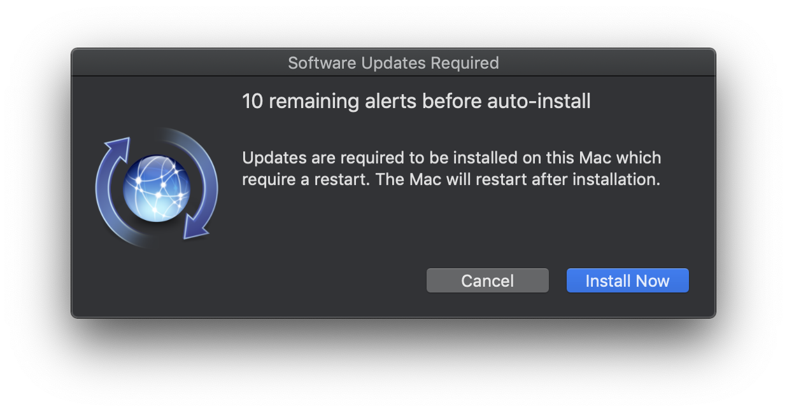
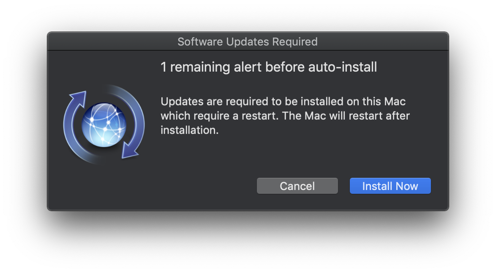
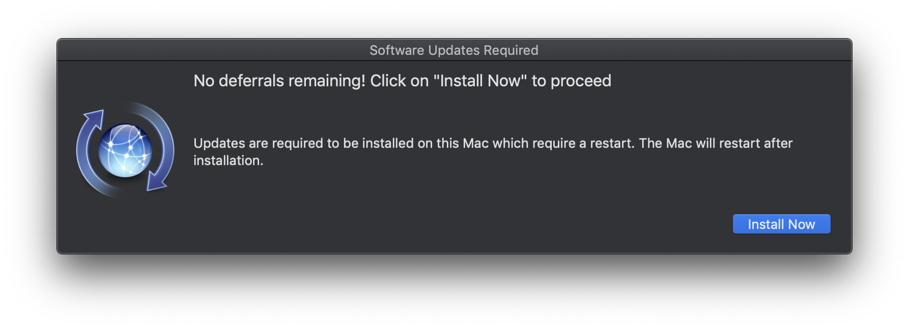

# Nice Updater 2.0

A tool to faciliate the updating of macOS that (nicely) gives the user several reminders to update before becomgin really annoying.

This fork removes the requirement for the Yo.app and uses the `jamfHelper` tool instead. Additional configuration opportunities have also been added.

Version 2 removes the use of `softwareupdate` for installing updates that require a restart. Updates that can be carried out without a restart are still performed using `softwareupdate`. For those that require a restart, the Software Update pane is opened instead.

## Requirements

### Jamf Pro Requirements

- `jamfHelper` is used to display the user dialogs when updates are required or are being installed.

## Build the Project into a .PKG

To build new versions you can simply run the `./build.sh` script and specify a version number for the `.pkg`. The resulting `.pkg` will include the LaunchDaemons and target script as well as necessary preinstall/postinstall scripts. If you do not include a version number as a parameter then the current tag will be assigned as the default.

You can customise the settings of the script within `build.sh`. For instance, you can change the default time between script runs, and you can change the identifier of the preferences files.

```bash
git clone https://github.com/grahampugh/nice-updater.git
cd nice-updater
# (edit build.sh to suit your settings)
./build.sh
```

## Testing

If you [build](https://github.com/grahampugh/nice-updater#build-the-project-into-a-pkg) the .pkg or download one of the [releases](https://github.com/grahampugh/nice-updater/releases), after installation the Launch Daemon is automatically started.

Tail the log to see the current state:

```bash
tail -f /Library/Logs/Nice_Updater.log
```

You can do this several times to see the entire alerting/force-update workflow.

## Workflow and Options

The `nice_updater.sh` script is not intended to be executed by simply running the script. It is intended to be executed by passing a parameter into it indicating which function to run. If you do not specify a function, then the script just exits. As an example the primary LaunchDaemon executes the script in this fashion: `/bin/bash /Library/Scripts/nice_updater main`. "Main" indicates the function that is being run.

Default settings are set in `build.sh`. This script overwrites the contents of the LaunchDaemons and Preferences file when run.

### Overriding parameters with a Jamf postinstall script

The settings can also be overridden using a Jamf script, for example as a postinstall script in the policy that installs the nice updater. A working postinstall script is provided in this repo named `jamf_postinstall_script_for_nice_updater.sh`. The overridable parameters are as follows:

| Parameter | Description                                                                                                                                   | Default |
| :-------: | :-------------------------------------------------------------------------------------------------------------------------------------------- | :-----: |
|     4     | Start interval - hour of the day, e.g. 13 = 1pm. If left blank, the policy would run every hour.                                              |   13    |
|     5     | Start interval - minute of the hour, e.g. 45 = 45 mins past the hour, e.g. 13:45                                                              |    0    |
|     6     | Alert timeout in seconds. The time that the alert should stay on the screen (should be less than the start interval)                          |  3590   |
|     7     | Max number of deferrals. Default is 11 so first message says "10 remaining alerts".                                                           |   11    |
|     8     | Number of days to wait after an empty software update run                                                                                     |    3    |
|     9     | Number of days to wait after a full software update is carried out                                                                            |   14    |
|    10     | Custom icon path - must exist on the device before the policy is run. Empty by default, so that the standard "Software updates" icon is used. |    -    |

The primary LaunchDaemon is therefore scheduled to be run at 13:00 every day, but overridable. What happens when it runs is determined by a few things:

### When a User is Not Logged In

- Updates are downloaded. Updates that do not require a restart are installed. Others cannot be applied while not logged in.

### When a User is Logged In

- Updates are downloaded, and if no restart is required the updates are installed immediately in the background.
- If a restart _is_ required the user will be alerted via a jamfHelper dialog. The user can choose to cancel the alert, or install the restart-required updates now.
- If they click on Install Now, the Software Update pane is opened.
- If they subsequently close the Software Update pane without performing the upgrade, the user is alerted again, with one fewer chance to defer.
- The default number of alerts before a forced install of the restart-required updates is 10. This can be changed for your environment. When using this default value a single user gets alerted 10 times (once every day) and has the option to install at any of those points, if they do not, one day after the last alert the update will be applied and the Mac will restart. The user is will also receive a jamfHelper dialog when the updates are being applied letting them know their machine will restart soon.
- The alert logic tracks which users are alerted, so it will only forcibly install those restart-required updates if the same user is alerted 10 times (when using the default value).

### Delay Running After No Updates Available

You can specify the number of days to delay the process after an update check occurs where no updates were found (default is 3). This delay will ensure that we are not checking for updates all day long if there are no updates found in the morning. This is also a good way to stagger updates out over your entire fleet.

### Blocking Updates

If you want to block updates from running during a certain period, you can write a "updates_blocked" key with a boolean value of "true" to the main preference file (/Library/Preferences/com.github.grahampugh.nice_updater.plist).

```bash
defaults write /Library/Preferences/com.github.grahampugh.nice_updater.plist updates_blocked -bool true
```

To reverse this setting simply set the key value to false or delete the key.

## Alert Logic

A user is only alerted when updates are pending that require a restart. If a user is being alerted, they will receive a jamfHelper alert, which they can dismiss. By default a single user can be alerted 10 times before they will receive a jamfHelper message indicating that updates are in progress and the Mac will restart soon. The built-in alert logic tracks which users receive the alerts. In multi-user environments, this is very important because if you simply alert whichever user is logged in at that moment then count those alerts up, you might have a situation where a specific user is only alerted once or not at all before restart-required updates are force-installed.

### Alert Examples

The alert indicates that updates requiring a restart are pending. It will timeout after the specified time in the `AlertTimeout` preferences key. If it times out, the remaining alerts stays unchanged. If Cancel is pressed, one remaining alert is taken away.


The second to the last alert lets the user know that they will receive one more alert prior to force-installing updates and restarting.


In the final alert that the user receives, they will be warned to "Install now to avoid interruptions". This alert cannot be cancelled, and has a pre-set duration of 5 minutes (not overridable).


## Uninstaller

An uninstall script named `nice_updater_uninstall.sh` is provided here, which removes the preferences and scripts, and unloads and deletes the LaunchDaemons. This could be used in an Uninstaller policy in Jamf Pro.
